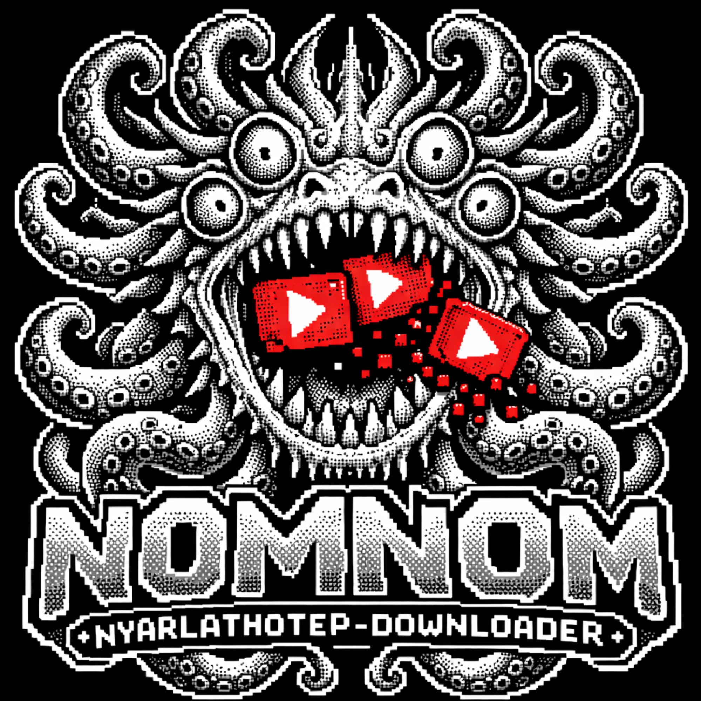

<div align="center">



# NOMNOM — Nyarlathotep Downloader

**YouTube bulk downloader. Paste anything. Download everything.**

*Vibed by [Iannis Bardakos](https://www.johnbardakos.com)*

[](https://github.com/Jbardakos/NOMNOM/releases)
[](https://github.com/Jbardakos/NOMNOM/releases)
[](https://python.org)
[](LICENSE)

</div>

---

## What it does

Paste any blob of text — a chat log, a browser history export, a list of links. NOMNOM extracts every YouTube URL automatically and downloads them all as best-quality MP4s.

---

## Quick Start (pre-built app)

1. Download `NOMNOM.app.zip` from [Releases](https://github.com/Jbardakos/NOMNOM/releases)
2. Unzip and drag `NOMNOM.app` to your Applications folder
3. Install ffmpeg: `brew install ffmpeg`
4. Double-click and go

> **macOS blocked it?**
> ```bash
> xattr -dr com.apple.quarantine /Applications/NOMNOM.app
> ```

---

## Build from source

### Prerequisites

```bash
# Homebrew (if not installed)
/bin/bash -c "$(curl -fsSL https://raw.githubusercontent.com/Homebrew/install/HEAD/install.sh)"

# Python 3.10+
brew install python

# ffmpeg (required for MP4 merging)
brew install ffmpeg
```

### Build

```bash
git clone https://github.com/Jbardakos/NOMNOM.git
cd nomnom
chmod +x build.sh
./build.sh
```

Output: `dist/YTDL.app`

```bash
open dist/YTDL.app
```

### What `build.sh` does

1. Creates a Python virtual environment (`venv/`)
2. Installs `PySide6`, `yt-dlp`, `pyinstaller`
3. Runs PyInstaller — bundles Python + all dependencies into a self-contained `.app`
4. The `ui/` folder (HTML interface) is included in the bundle

---

## Project structure

```
nomnom/
├── app.py              ← Main Python app (PySide6 + QWebEngine + yt-dlp)
├── build.sh            ← One-command build script
├── requirements.txt    ← Python dependencies
├── ui/
│   └── index.html      ← Full UI (HTML/CSS/JS, talks to app.py via QWebChannel)
└── README.md
```

---

## How it works

```
┌─────────────────────────────────────────────┐
│              ui/index.html                  │
│  paste → extract URLs → queue → progress   │
│         QWebChannel (JS ↔ Python)           │
└──────────────┬──────────────────────────────┘
               │ backend.startDownloads([urls])
               ▼
┌─────────────────────────────────────────────┐
│                 app.py                      │
│  yt_dlp.YoutubeDL → progress_hook → Signal │
│  statusChanged.emit(json) → UI updates     │
└─────────────────────────────────────────────┘
               │
               ▼
   ~/Downloads/YTDL_DDMMYYYY/
   └── Video Title.mp4
```

- **No server.** No polling. No HTTP tricks. PySide6 `Signal/Slot` pushes progress directly to the WebView in real time.
- **yt-dlp is bundled** as a Python library — no external binary needed.
- **ffmpeg is the only external dependency** — required to merge best-quality video+audio into MP4.

---

## Stack

| Component | Technology |
|-----------|-----------|
| App shell | PySide6 (Qt6) |
| Web view  | QWebEngineView |
| IPC       | QWebChannel (JS ↔ Python) |
| Downloader| yt-dlp Python API |
| Packaging | PyInstaller |
| UI        | HTML · CSS · Vanilla JS |

---

## Troubleshooting

**Downloads fail silently**
```bash
brew upgrade yt-dlp  # YouTube changes frequently, yt-dlp patches fast
```
> If you built from source, update the library instead:
> ```bash
> source venv/bin/activate && pip install -U yt-dlp
> ```

**No sound / wrong format**
```bash
brew install ffmpeg   # required for best-quality MP4 merging
```

**App won't open (Apple quarantine)**
```bash
xattr -dr com.apple.quarantine dist/YTDL.app
open dist/YTDL.app
```

**Slow build / Qt download**
PySide6 is ~300MB. The first build downloads it once; subsequent builds use the cached `venv/`.

---

## License

MIT — do whatever you want with it.

---

<div align="center">
<sub>NOMNOM // Nyarlathotep Downloader // Vibed by Iannis Bardakos</sub>
</div>
